# IntakeAI: Final Project Report
### Intelligent & Multimodal Patient Intake Assistant

---

## Executive Summary
**IntakeAI** is a state-of-the-art medical tool designed to revolutionize the patient-to-provider transition. By leveraging the power of **Stitch AI** for premium design, **Google Gemini 2.0 Flash Lite** for intelligence, and **CrewAI** for multi-agent orchestration, the system transforms raw patient inputs into professional clinical briefs.

The project successfully delivers a **Single Page Application (SPA)** with a premium medical aesthetic, ensuring a seamless and reassuring user experience for patients in high-stress clinical environments.

---

## 🎨 Visual Identity & UI Design
The frontend was redesigned using **Stitch AI** to provide a "premium clinic" feel, moving away from generic templates to a custom-crafted design system.

### Design Tokens
- **Color Palette**: 
  - **Primary**: `#1a6b59` (Deep Medical Teal - represents trust and tranquility).
  - **Accents**: Gold flourishes for "Verification" and "Premium" status badges.
- **Typography**: 
  - **Display**: `Playfair Display` (Serif) for a sophisticated, professional medical look.
  - **Body**: `Inter` (Sans-serif) for high legibility and modern clarity.
- **Glassmorphism**: Leverages semi-transparent cards with `backdrop-filter` for a modern, airy feel.

### Interactive States
1. **Landing Page**: A high-impact hero section with smooth entry animations (`fade-up`).
2. **Dynamic Intake Form**: An adaptive form that toggles sections (like symptom photos) based on user selections.
3. **Neural Processing State**: A dedicated waiting screen with animated medical icons and real-time step indicators.
4. **Clinical Summary**: A structured, print-ready document card with a dedicated verification footer.

---

## 🛠 Technical Architecture

### 1. Frontend: Single Page Application (SPA)
Built using **Vanilla JavaScript** and **Tailwind CSS**, the frontend avoids the overhead of large frameworks while maintaining highly responsive state management via a custom `showScreen()` navigation logic.

- **Audio Engine**: Uses `MediaRecorder` API to capture high-quality clinical symptoms.
- **Form Data Pipeline**: Bundles text inputs, audio blobs, and multiple files into a single `multipart/form-data` request.

### 2. Backend: Agentic Workflow (FastAPI)
The backend is powered by **FastAPI** and orchestrates four distinct AI agents via **CrewAI**.

```mermaid
graph TD
    User((Patient)) --> UI[SPA Frontend]
    UI -- Multipart Request --> API[FastAPI Backend]
    
    subgraph "AI Processing Pipeline"
        API --> STT[Speech-to-Text]
        API --> Vision[Vision Analysis]
        
        STT --> Crew
        Vision --> Crew
        
        subgraph "CrewAI Agents"
            Crew --> A1["👨‍⚕️ Intake Agent<br/>(Extracts Basic Info)"]
            Crew --> A2["📄 Document Agent<br/>(Analyzes Lab Reports)"]
            Crew --> A3["📜 History Agent<br/>(Extracts Medical Patterns)"]
            Crew --> A4["✍️ Summary Agent<br/>(Synthesizes Clinical Brief)"]
        end
    end
    
    A4 --> Output[Final Medical Brief]
    Output -- JSON --> UI
```

### 3. Multimodal Integration
- **Speech**: Transcribes patient voice recordings into structured clinical text.
- **Vision**: Analyzes symptom photos (e.g., rashes, injuries) to extract visual descriptors.
- **OCR/Document Analysis**: Reads medical reports and extracts key lab values and diagnoses.

---

## 🧪 Verification & Stability
- **API Resilience**: The application is optimized for the **Gemini 2.0 Flash Lite** model, balancing performance and token efficiency.
- **Error Handling**: Implemented a global exception handler in FastAPI and a real-time error banner in the UI to handle API quota limits (429 errors) gracefully.
- **HIPAA Considerations**: Data is processed in transient memory and temporary files are purged immediately after AI ingestion.

---

## 🚀 Future Roadmap
1. **EMR Integration**: Directly push the generated Markdown summaries into Epic or Cerner via HL7 FHIR APIs.
2. **Multilingual Support**: Real-time translation of non-English patient inputs into English clinical briefs.
3. **Vital Statistics Prediction**: Predict potential vital sign ranges based on symptom severity and history.

---

> [!IMPORTANT]
> **Project Status**: COMPLETED & DEPLOYED
> **Core Developer**: Antigravity AI
> **Environment**: Production-Ready (FastAPI + SPA)

---
*Created on: February 22, 2026*
